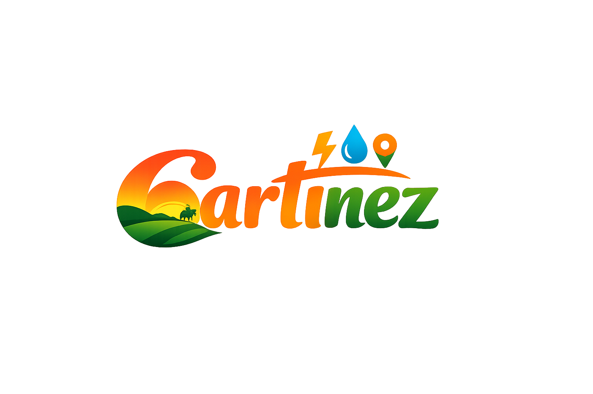

<p align="center">
  
</p>

<h1 align="center">Cartinez</h1>
<p align="center"><em>Alertas y reportes ciudadanos impulsados por la comunidad 🌄</em></p>

<p align="center">
  
  
  
</p>

---

## 🏙️ ¿Qué es Cartinez?

**Cartinez** es una aplicación móvil de alertas y reportes ciudadanos impulsada por la comunidad de Villavicencio, Meta. Permite a las personas informar y consultar problemas en la ciudad como:

- 🔌 Cortes de luz
- 💧 Falta de agua
- 🚧 Calles dañadas
- 📢 Y más incidentes del día a día

> *"El que es buen llanero, no abandona a su gente."*

---

## ✨ Funcionalidades Implementadas (V1)

### 🖼️ Pantalla de Bienvenida
- Fondo inmersivo con la identidad visual de Villavicencio
- Animaciones de entrada escalonadas (logo, lema, botones)
- Navegación al Login y Registro

### 🔐 Pantalla de Inicio de Sesión
- Tarjeta compacta adaptada al viewport sin scroll innecesario
- Animaciones en cascada por elemento
- Candado animado para mostrar/ocultar contraseña (`AnimatedLock`)
- Botón de volver y enlace a Registro

### 📝 Pantalla de Registro
- Hero image de Cristo Rey con overlay elegante
- Logo Cartinez en la esquina inferior izquierda de la imagen
- Formulario scrolleable: Nombre, Apellido, Correo, Teléfono (+57 por defecto), Contraseña y Confirmación
- Checkbox animado de Términos y Condiciones
- Animaciones que se re-ejecutan cada vez que el usuario entra a la pantalla

---

## 🛠️ Stack Tecnológico

| Tecnología | Versión | Uso |
|---|---|---|
| **Expo** | SDK 52 | Entorno base estable |
| **React Native** | 0.76 | Framework móvil |
| **React** | 18.3.1 | UI |
| **Moti + Reanimated 3** | 3.16.1 | Animaciones premium |
| **React Navigation** | Stack v6 | Navegación entre pantallas |
| **TypeScript** | — | Tipado estático |

---

## 📁 Estructura del Proyecto

```
src/
├── animations/
│   ├── EntranceAnimation.tsx   # Sistema modular de animaciones de entrada
│   └── AnimatedLock.tsx        # Candado interactivo con animación de giro
├── screens/
│   ├── WelcomeScreen.tsx       # Pantalla de bienvenida
│   ├── LoginScreen.tsx         # Inicio de sesión
│   └── RegisterScreen.tsx      # Registro de usuario
├── styles/
│   ├── WelcomeStyles.ts
│   ├── LoginStyles.ts
│   └── RegisterStyles.ts
└── assets/
    └── image/                  # Recursos visuales de la app
```

---

## 🚀 Cómo ejecutar

```bash
# Instalar dependencias
npm install

# Iniciar con caché limpio
npx expo start -c
```

Escanea el QR con **Expo Go** en tu celular Android.

---

**Cartinez · Villavicencio Conectado 🦅**
